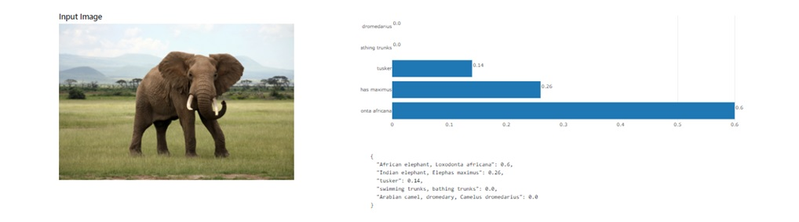

# Image Recognition

### About This Demo Application
In this *Image Recognition* demo, we demonstrate the workings of a deep learning model that tries to identify images shown to it. It does this by trying to classify the image according to how closely it matches images the deep learning model has previously been trained on. In our case, we use the famous VGG16 model that comes built in with Keras. This model was trained on the ImageNet 2014 data set of 100,000+ images belonging to 1000 categories (labels). The result is actually a probability score for each of the 1000 image categories (labels) that the model recognizes/was trained on. Our best guess is the label with the highest probability. 



Please look at the notebook in the rorodata github repository [here](https://github.com/rorodata/image-recognition-demo/blob/master/notebooks/Image_Recognition_NB.ipynb) for more details.

### Productionizing Machine Learning Models Using rorodata 
Below, we discuss how a data scientist can deploy and manage data science models in production using rorodata platform, with just a few simple lines of command from a CLI. In this writeup, we shall illustrate this using Python, a similar write-up for R is on the way. 

To understand the big picture view about the rorodata platform, [go here](https://github.com/rorodata/documents/blob/master/about-rorodata.md)


#### Prerequisites
- Download roro client for python3 using `pip install roro-client`. Note that currently, we only support python 3.5 and above.
- You must have a rorodata platform account, as the models will be deployed on rorodata platform for this example. You may request access here. 

#### Steps (code only)
```
> git clone https://github.com/rorodata/image-recognition-demo.git
> cd image-recognition-demo

# NOTE: edit roro.yml to change project name to name of new project, I am using the project name image-recognition for this example
> roro create image-recognition
Created project: image-recognition

> roro deploy
Deploying project image-recognition. This may take a few moments ...
Restarted {} services. 1
default: https://image-recognition.rorocloud.io/

#inspect processes, just to check if the service is running
> roro ps
JOBID     STATUS    WHEN            TIME     INSTANCE TYPE    CMD
--------  --------  --------------  -------  ---------------  -------------------------------------
b0905fk7t  running   1 minute ago    0:01:43  C1               firefly -b 0.0.0.0:8080 predict.predict
```

#### Steps (verbose)
1.	Clone the code repository rorodata/credit-scoring-demo (manually or using git) and download the files to a local directory. You will shortly deploy this repository on rorocloud as your own project.
2.	Pick a unique project name for the project you are about to create on the data platform. Remember to keep a short readable name without spaces or special characters (hyphen is ok). 
3.	Edit the roro.yml file, and change the part after project: to match your project name exactly, and save it. The roro.yml is a simple text file that tells the rorodata platform what to do during deployment. You can understand more about the structure and specifications that can go into the YML file here 
4.	You will now deploy code from the local repository you just edited, into production on rorodata platform.  Navigate to the above mentioned repository using command prompt. From here, login to the rorodata platform using roro login from command prompt. You are now using roro client connected to rorodata platform. Send us an email if you run into any issues and we shall help you out quickly
5.	Create your (new) project using the command roro create your-project-name. Remember to us the same name you picked in step 2,3. Remember, this project is the entire machine learning application including its code, all associated tasks and services, persistent data volumes, and ML models. Once done, you can use the command roro projects to view a list of all your projects. Make sure that you can see the project you just created.
6.	You are now ready to deploy your project code to production. From the same command prompt location as in the previous step, type roro deploy and press enter. This When a project is deployed, rorodata takes its cue from the roro.yml file and execute deployment steps one by one. You can see a list / trace of all these steps once roro deploy finishes.
7.	Your services should now be ready and serving, with URL endpoints for each service as instructed by you in the roro.yml file.   You can check if the service is running using the command roro ps –a.  
8.	The rorodata platform services are REST-APIs, and can be accessed using any client service. The easiest way to test this is through our firefly library. You can install this using pip install firefly-python and query the service using the same example as in the notebook
9.	Let’s now use the API we created, to see how well our model recognizes images.
```
#we will use firefly to call our API, you can use any other library e.g. Requests
> import firefly

> imgrec_api=firefly.Client("https://image-recognition.rorocloud.io")

> print(imgrec_api.predict(image_file=open('haati.jpg', "rb"), format='jpg'))
{'labels': ['tusker', 'African elephant, Loxodonta africana', 'Indian elephant, Elephas maximus', 'triceratops', 'gorilla, Gorilla gorilla'], 'probs': [0.5, 0.47999998927116394, 0.029999999329447746, 0.0, 0.0]}
```
